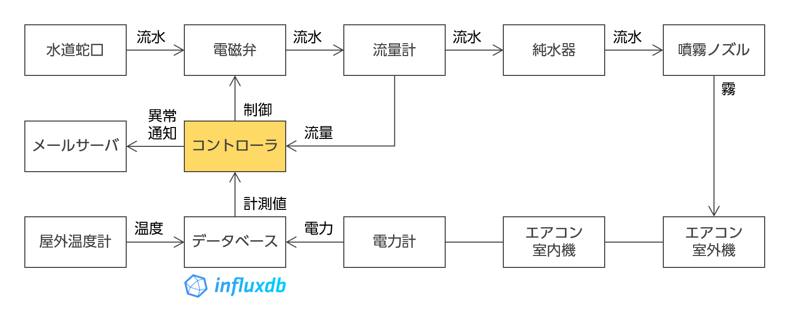
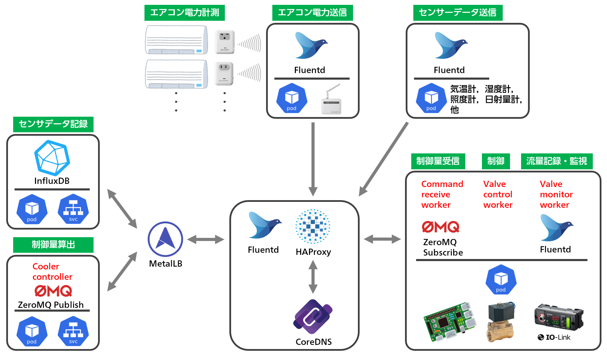
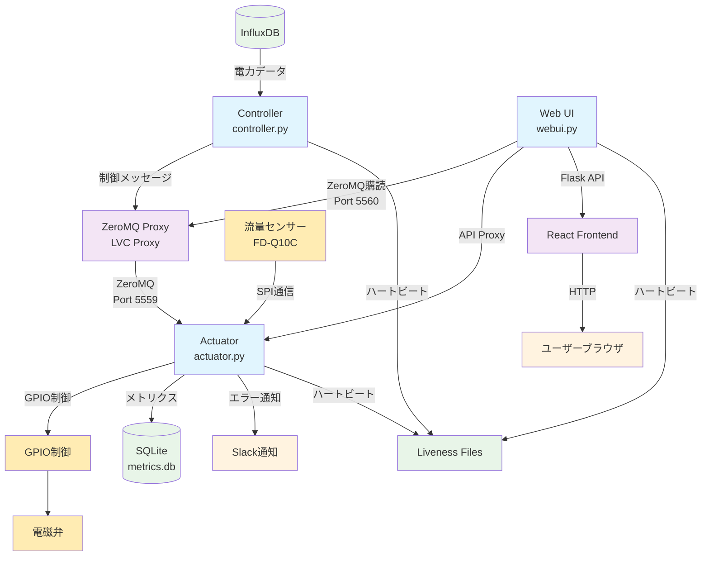
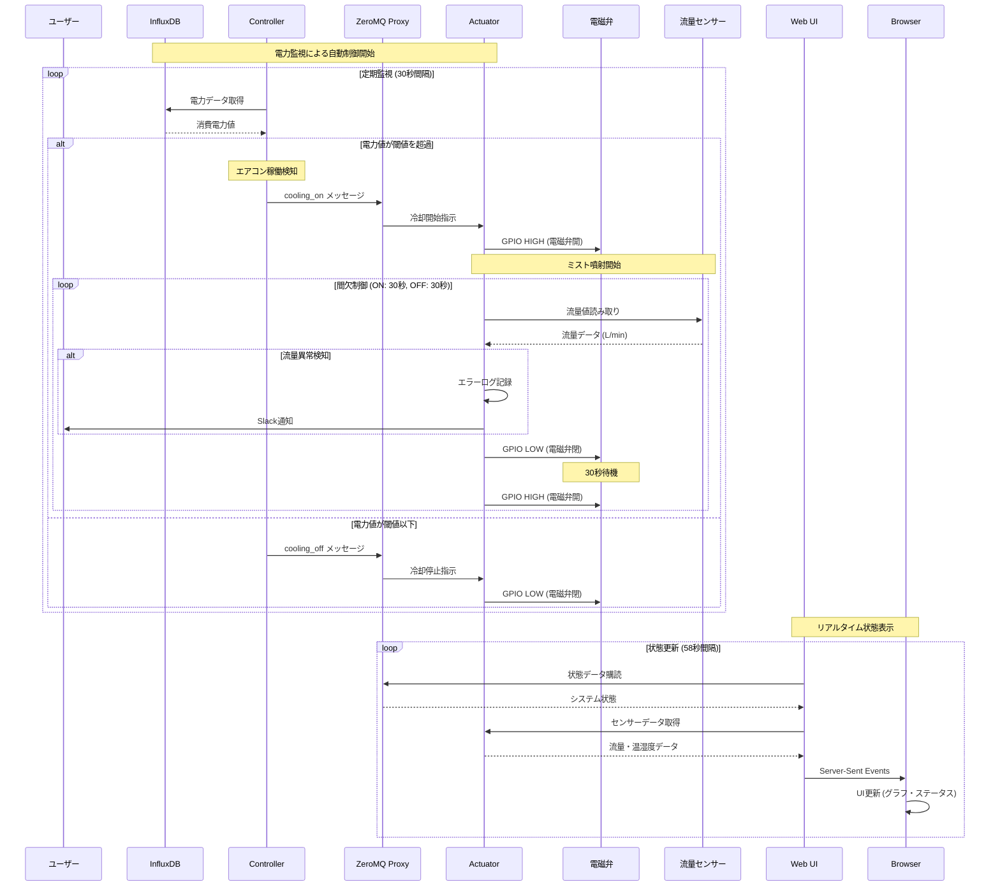
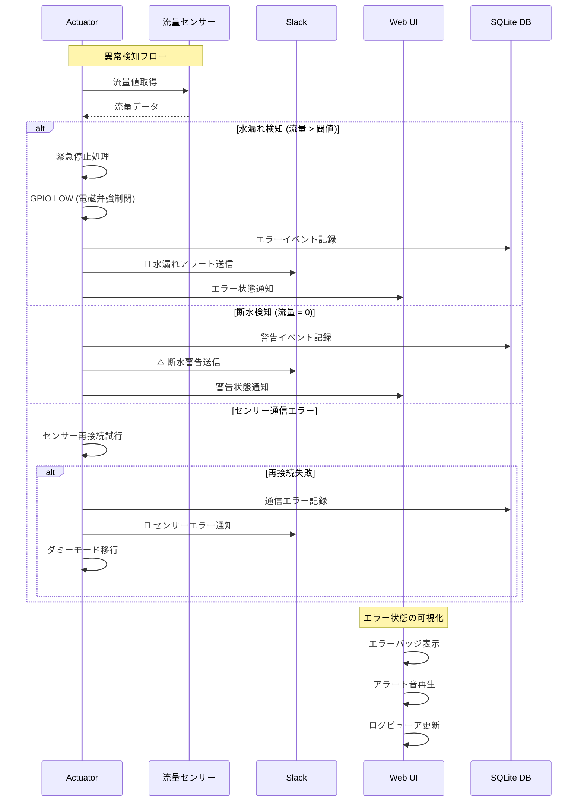

# ❄️ outdoor-unit-cooler

Raspberry Pi を使ったエアコン室外機自動冷却システム

[](https://github.com/kimata/unit-cooler/actions/workflows/regression.yaml)

## 📑 目次

- [📋 概要](#-概要)
    - [主な特徴](#主な特徴)
- [⚙️ 自動制御構造](#️自動制御構造)
- [🎮 デモ](#-デモ)
- [🏗️ システム構成](#️-システム構成)
    - [アーキテクチャ](#アーキテクチャ)
    - [技術スタック](#技術スタック)
- [🚀 セットアップ](#-セットアップ)
    - [必要な環境](#必要な環境)
    - [1. リポジトリのクローン](#1-リポジトリのクローン)
    - [2. Raspberry Pi の設定](#2-raspberry-pi-の設定)
    - [3. 設定ファイルの準備](#3-設定ファイルの準備)
- [💻 実行方法](#-実行方法)
    - [Docker を使用する場合（推奨）](#docker-を使用する場合推奨)
    - [Docker を使用しない場合](#docker-を使用しない場合)
    - [開発モード](#開発モード)
- [🧪 テスト](#-テスト)
- [🎯 API エンドポイント](#-api-エンドポイント)
- [☸️ Kubernetes デプロイ](#️-kubernetes-デプロイ)
- [🔧 トラブルシューティング](#-トラブルシューティング)
    - [よくある問題](#よくある問題)
    - [ログ確認](#ログ確認)
- [📊 CI/CD](#-cicd)
- [📝 ライセンス](#-ライセンス)

## 📋 概要

エアコンの消費電力をリアルタイムで監視し、運転開始を検知すると自動的に室外機へのミスト噴射を行うスマートな冷却システムです。間欠的なミスト噴射により室外機の熱交換効率を向上させ、エアコンの消費電力を削減します。

### 主な特徴

- ❄️ **自動制御** - エアコンの稼働状況を自動検知してミスト噴射を制御
- 💧 **効率的な冷却** - 連続噴射ではなく間欠噴射で効果的に室外機を冷却
- 🔍 **異常検知** - 流量計による水漏れ・元栓の開閉状態監視
- 📊 **リアルタイム監視** - Web UIでシステム状況をリアルタイム表示
- 📱 **通知機能** - Slackを通じたエラー通知とアラート
- 🏠 **省エネルギー** - 室外機の熱交換効率向上により消費電力を削減
- 🔧 **メンテナンスフリー** - 全自動運転で人手を必要としない

## ⚙️ 自動制御構造



## 🎮 デモ

実際の動作を体験できるデモサイト：

🔗 https://unit-cooler-webui-demo.kubernetes.green-rabbit.net/unit-cooler/

## 🏗️ システム構成

### アーキテクチャ



#### システム構成図



#### シーケンス図

##### 通常の冷却動作シーケンス



##### エラーハンドリングシーケンス



システムは3つの主要コンポーネントで構成：

1. **Controller（コントローラ）** - InfluxDBから消費電力データを監視し、制御信号を生成
2. **Actuator（アクチュエータ）** - 電磁弁を制御し、水流量を監視
3. **Web UI** - システム状況の可視化とログ表示

#### プロセス間通信

- **ZeroMQ Publisher-Subscriber**パターンでリアルタイム分散メッセージング
- **Last Value Caching (LVC) Proxy**による信頼性向上と最新値キャッシュ
- Controller → Actuator: ポート5559（制御信号）
- Web UI ← Controller: ポート5560（状態監視）

### 技術スタック

#### フロントエンド

- **フレームワーク**: React 18
- **UIライブラリ**: Bootstrap + React Bootstrap
- **ビルドツール**: Vite
- **言語**: TypeScript/JavaScript

#### バックエンド

- **フレームワーク**: Flask (Python)
- **パッケージマネージャー**: uv (高速・モダン)
- **通信**: ZeroMQ (プロセス間通信)
- **データベース**: InfluxDB (センサーデータ), SQLite (ログ)

#### ハードウェア

- **制御**: Raspberry Pi + GPIO制御
- **センサー**: 流量センサー (FD-Q10C)
- **アクチュエータ**: 電磁弁 (DC12V)

## 🚀 セットアップ

### 必要な環境

- Raspberry Pi (GPIO制御が可能なモデル)
- Python 3.12+
- Node.js 20.x
- Docker (オプション)

### 1. リポジトリのクローン

```bash
git clone https://github.com/kimata/unit-cooler.git
cd unit-cooler
```

### 2. Raspberry Pi の設定

#### ハードウェアインターフェースの有効化

`/boot/firmware/config.txt` に下記の設定を追加：

```text
# SPIインターフェースを有効化（流量センサー用）
dtparam=spi=on

# Bluetoothを無効化（シリアルポート競合回避）
dtoverlay=disable-bt
```

#### シリアルコンソールの無効化

`/boot/firmware/cmdline.txt` から `console=serial0,115200` および `console=ttyAMA0,115200` の指定を削除。

#### GPIOアクセス権限の設定

```bash
# GPIOグループにユーザーを追加
sudo usermod -a -G gpio $USER

# 再起動して設定を反映
sudo reboot
```

### 3. 設定ファイルの準備

```bash
cp config.example.yaml config.yaml
# config.yaml を環境に合わせて編集
```

設定項目の例：

- InfluxDB接続設定（センサーデータの保存先）
- GPIO設定（電磁弁制御用のピン番号）
- Slack設定（エラー通知用）
- 流量センサー設定（異常検知の閾値）

## 💻 実行方法

### Docker を使用する場合（推奨）

```bash
# フロントエンドのビルド
cd react
npm ci
npm run build
cd ..

# Docker Composeで起動
docker-compose up -d

# ログの確認
docker-compose logs -f
```

### Docker を使用しない場合

#### uv を使用（推奨）

```bash
# uvのインストール（未インストールの場合）
curl -LsSf https://astral.sh/uv/install.sh | sh

# 依存関係のインストール
uv sync

# Controller（任意のLinux環境で実行可能）
uv run python ./src/controller.py -c config.yaml

# Actuator（Raspberry Piで実行）
uv run python ./src/actuator.py -c config.yaml

# Web UI（任意のLinux環境で実行可能）
uv run python ./src/webui.py -c config.yaml
```

### 開発モード

```bash
# フロントエンド開発サーバー
cd react
npm start

# バックエンド（デバッグモード）
uv run python ./src/webui.py -c config.yaml -D

# ダミーモード（ハードウェアなしでテスト）
uv run python ./src/actuator.py -c config.yaml -d
```

## 🧪 テスト

```bash
# Pythonテスト（カバレッジ付き）
uv run pytest

# 特定のテストファイルを実行
uv run pytest tests/test_basic.py tests/test_error_handling.py

# 並列実行でテスト高速化
uv run pytest --numprocesses=auto

# E2Eテスト（Playwright）
uv run pytest tests/test_playwright.py
```

テスト結果：

- HTMLレポート: `tests/evidence/index.htm`
- カバレッジ: `tests/evidence/coverage/`
- E2E録画: `tests/evidence/test_*/`

## 📊 メトリクス・分析機能

システムの詳細な運用データを収集・分析し、パフォーマンス最適化に活用できます。

### データ収集項目

- **1分毎のシステムメトリクス**:
    - `cooling_mode`: 冷却モード（0: OFF, 1: ON）
    - `duty_ratio`: デューティ比（ON時間/全体時間の比率）
    - `flow_value`: ON時の流量値（L/min）

- **1分毎の環境データ**:
    - `temperature`: 気温（℃）
    - `humidity`: 湿度（%）
    - `lux`: 照度（lux）
    - `solar_radiation`: 日射量（W/m²）
    - `rain_amount`: 降雨量（mm）

- **1時間毎の運用データ**:
    - `valve_operations`: バルブ操作回数

- **エラーイベント**:
    - `error_type`: エラー種別
    - `error_message`: エラー詳細メッセージ

### 分析機能

- **時系列推移グラフ**: 設定可能期間（7-30日）のトレンド分析
- **箱ひげ図**: 時間帯別（0-23時）の統計分布
- **相関分析**: 環境要因とシステム性能のPearson相関係数
- **外れ値検出**: IQR法による異常値検出
- **統計サマリー**: 平均値、中央値、標準偏差、最小/最大値

### データベース構造

**SQLite**: `data/metrics.db`（設定ファイル `actuator.metrics.data` で変更可能）

```sql
-- 分単位メトリクス
minute_metrics (
    timestamp DATETIME,
    cooling_mode INTEGER,
    duty_ratio REAL,
    temperature REAL,
    humidity REAL,
    lux REAL,
    solar_radiation REAL,
    rain_amount REAL,
    flow_value REAL
)

-- 時間単位メトリクス
hourly_metrics (
    timestamp DATETIME,
    valve_operations INTEGER
)

-- エラーイベント
error_events (
    timestamp DATETIME,
    error_type TEXT,
    error_message TEXT
)
```

### 必要なライブラリ

高度な分析機能を使用するには以下のライブラリが必要：

```bash
uv add pandas scipy  # 相関分析・統計計算用
```

## 🎯 API エンドポイント

### システム状態

- `GET /unit-cooler/api/status` - システム全体の状態取得
- `GET /unit-cooler/api/sensor` - センサーデータ取得

### 制御

- `POST /unit-cooler/api/valve_ctrl` - 電磁弁の手動制御
- `GET /unit-cooler/api/mode` - 動作モード取得/設定

### ログ・履歴

- `GET /unit-cooler/api/log` - システムログ取得
- `GET /unit-cooler/api/log_view` - ログビューア

### メトリクス

- `GET /unit-cooler/api/metrics` - 包括的メトリクスダッシュボード

## ☸️ Kubernetes デプロイ

Kubernetes用の設定ファイルが含まれています：

```bash
# namespaceの作成
kubectl create namespace hems

# デプロイ
kubectl apply -f kubernetes/unit-cooler.yml

# 状態確認
kubectl get pods -n hems
kubectl logs -n hems -l app=unit-cooler-controller
kubectl logs -n hems -l app=unit-cooler-actuator
```

詳細は設定ファイルをカスタマイズしてご利用ください。

## 🔧 トラブルシューティング

### よくある問題

#### 電磁弁が動作しない

- **GPIO権限不足**: `sudo usermod -a -G gpio $USER` を実行後、再起動
- **配線確認**: GPIO17番ピンと電磁弁の接続を確認
- **設定確認**: `config.yaml` の `actuator.gpio.valve_pin` をチェック

#### 流量センサーが読み取れない

- **シリアルポート競合**: Bluetoothが無効化されているか確認
- **権限不足**: `/dev/ttyAMA0` へのアクセス権限を確認

#### Web UIにアクセスできない

- **ポート確認**: デフォルトポート5000が開いているか確認
- **サービス確認**: `docker-compose ps` でサービス起動状況を確認

### ログ確認

```bash
# Dockerの場合
docker-compose logs -f controller
docker-compose logs -f actuator
docker-compose logs -f webui

# ネイティブ実行の場合
# 各コンポーネントのログは標準出力に表示
```

## 📊 CI/CD

GitHub Actions によるCI/CDパイプライン：

- テスト結果: https://kimata.github.io/unit-cooler/
- カバレッジレポート: https://kimata.github.io/unit-cooler/coverage/

## 📝 ライセンス

このプロジェクトは MIT License のもとで公開されています。

---

<div align="center">

**⭐ このプロジェクトが役に立った場合は、Star をお願いします！**

[🐛 Issue 報告](https://github.com/kimata/unit-cooler/issues) | [💡 Feature Request](https://github.com/kimata/unit-cooler/issues/new?template=feature_request.md) | [📖 詳細なドキュメント](./docs)

</div>
