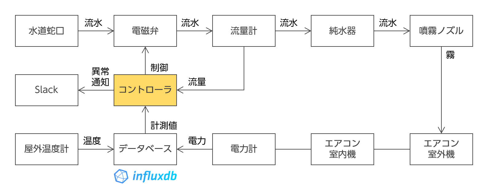

# エアコン室外機冷却システム

## 概要

エアコンが動作を開始すると自動的に室外機へのミスト噴射を行います．


## システム構成

### 全体構成



このプログラムは上図の「コントローラ」に対応します．

### ソフト構成


このプログラムは，上記の中で赤字で記載した 4 つのスレッドに対応します．

- Cooler controller
- Command receive worker
- Valve control worker
- Valve monitor worker

## 詳細

- F-PLUG やシャープの HEMS で計測した消費電力が infuxDB に記録されていることを前提にしています．
- ミスト噴射は常時噴射ではなく，ON/OFFを繰り返して効果的に冷却します．
- 流量計で流量をモニタし，元栓の開き忘れや水漏れを検知し，Slack で通知します．

## 準備

Ubuntu の場合，`install.sh` を実行すると apt を使って必要なライブラリがインストールされます．

`app/unit_cooler.py` を配置する Raspberry Pi では，`/boot/firmware/config.txt` に下記の
設定を記載しておきます．

```text
dtparam=spi=on
dtoverlay=disable-bt
```

## 設定

`src/config.example.yml` を `src/config.yml` に名前変更し，
電磁弁制御用の GPIO 端子番号と Slack 通知に関する設定を行います．

## 実行

`app/cooler_controller.py` と `app/unit_cooler.py` を実行します．

問題ないようでしたら，`cron/unit_cooler` を適宜編集した上で，
`/etc/cron.d` に配置して一定間隔で自動実行されるようにします．
